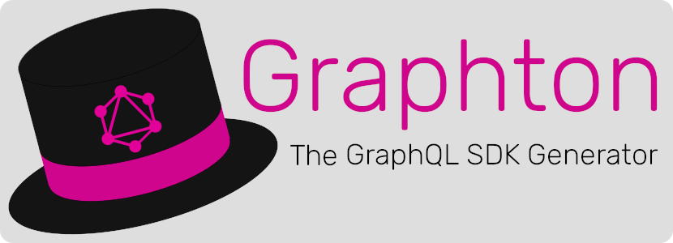

[](https://www.patreon.com/roboroads) 


# Graphton
A JS/TS generator that builds a GraphQL query builder for your API

> Note: this package is still in development. There might still be features missing, or things broken. Please report [Feature Requests](https://github.com/GraphtonLib/Graphton/issues/new?assignees=&labels=bug&template=bug_report.md) or [Bug Reports](https://github.com/GraphtonLib/Graphton/issues/new?assignees=&labels=bug&template=bug_report.md) on the [Issue tab](https://github.com/GraphtonLib/Graphton/issues). Thanks!


## Index

- [Installing](#installing)
    - [Yarn (recommended)](#yarn-recommended)
    - [npm](#npm)
- [CLI Usage & options](#cli-usage--options)
    - [Example CLI usage](#example-cli-usage)
- [Using the generated file](#using-the-generated-file)
    - [Build a query](#build-a-query)
    - [Add returnfields](#add-returnfields)
    - [Execute the query](#execute-the-query)
    - [Running a mutation](#running-a-mutation)
    - [Dynamically changing return fields](#dynamically-changing-return-fields)
    - [Global Settings](#global-settings)
- [Reference](#reference)
    - [GraphtonBaseQuery](#graphtonbasequery)
        - [returnFields](#returnfields)
        - [toQuery](#toquery)
    - [GraphtonBaseReturnTypeBuilder](#graphtonbasereturntypebuilder)
        - [all](#all)
        - [clear](#clear)
        - [with](#with)
        - [without](#without)
        - [except](#except)
        - [only](#only)
        - [withRelated](#withrelated)
        - [withoutRelated](#withoutrelated)
        - [toReturnTypeString](#toreturntypestring)
    - [GraphtonSettings](#graphtonsettings)
        - [setDefaultHeaders](#setdefaultheaders)
        - [setDefaultUrl](#setdefaulturl)
- [Links](#links)
- [Credits](#credits)
- [Contributing](#contributing)

## Installing

You can install Graphton to your dev-dependencies using a package manager.

#### Yarn (recommended)

```bash
yarn add -D @graphtonlib/grapton
# Then to run:
yarn graphton generate https://example.com/graphql
```

#### npm

```bash
npm i --save-dev @graphtonlib/grapton
# Then to run:
npm run graphton generate https://example.com/graphql
```

## CLI Usage & options

```text
Usage: graphton generate [options] <schemaUri>

Arguments:
  schemaUri                             URL to GraphQL endpoint or path to introspection json.

Options:
  -o, --outputFile <path>               Path to the generated js/ts file (default: "./src/graphton.generated.ts")
  -q, --exportQueryFactoryAs <name>     How you want to import your queries instance. (default: "Query")
  -m, --exportMutationFactoryAs <name>  How you want to import your mutations instance. (default: "Mutation")
  -h, --help                            display help for command

```

### Example CLI usage

```bash
yarn graphton generate -o ./src/lib/graphton.js https://example.com/graphql 
```

## Using the generated file

When the ts/js file is generated you can import the `Query` and `Mutation` factory instances from it. 

```typescript
import {Query, Mutation} from "./graphton.generated.js";
```

> Note: the names `Query` and `Mutation` are configurable! See [CLI Usage & options](#CLI+Usage+&+options)

> For the following examples, the example graphql schema from [example/schema.graphql](example/schema.graphql) will be used.

### Build a query

Starting a new query is fairly simple. Import `Query` from the generated file and call the method with the same name as the query you want to execute.

```typescript
import {Query} from "./example/graphton.generated.js";
const usersQuery = Query.users();
const getFirstUserQuery = Query.user({id: 1});
```

### Add returnfields

In GraphQL you have to define which fields you want to get in return. You do this with the queries ReturnTypeBuilder

```typescript
import {Query} from "./example/graphton.generated.js";
const usersQuery = Query.users().returnFields(r=>r.all());
const getFirstUserQuery = Query.user({id: 1})
    .returnFields(r=>r
        .with("id", "name")
        .withRelated('posts', r=>r
            .only("text")
        )
    );
```

### Execute the query

After building the query, you can directly execute it with the `get()` method.

```typescript
import {Query} from './example/graphton.generated.js';
const firstUser = await Query.user({id: 1})
    .returnFields(r=>r
        .with('id', 'name')
        .withRelated('posts', r=>r
            .only("text")
        )
    )
    .get();

// firstUser = {
//     data: {
//         id: 1,
//         name: "User One",
//         posts: [
//             {
//                 text: "A sample post!"
//             },
//             {
//                 text: "Enother sample post"
//             }
//         ]
//     },
//     response: /*AxiosReponse*/,
// }
```

### Running a mutation

Running mutations is about the same as running a query. The only diferences are:

 - You import `Mutation` instead of `Query`.
 - Instead of `.get()` you run `.do()`

> `.get()` and `.do()` are both available on queries and mutations - but for readability you *get* a query result, and *do* a mutation on the server.

```typescript
import {Mutation} from "./example/graphton.generated.js";
const newUser = await Mutation.createUser({name: 'User Infinite'})
    .returnFields(r=>r.all())
    .do();
const updatedUser = await Mutation.updateUser({id: 1, name: 'User NotOne', age: 12})
    .returnFields(r=>r.except('name')) // All fields except "name"
    .do();
```

### Dynamically changing return fields

Return fields can be dynamically changed.

```typescript
import {Query} from './example/graphton.generated.js';
const firstUserQuery = Query.user({id: 1})
    .returnFields(r=>r
        .with('id', 'name')
    );

if(getUserPosts) {
    firstUserQuery.returnFields(r=>r
        .withRelated('posts', r=>r
            .only("text")
        )
    )
}

if(hideUserName) {
    firstUserQuery.returnFields(r=>r
        .without('name')
    )
}
```

### Global Settings

You can change some of the settings, used for making the call to the server, like URL or headers.

```typescript
import {GraphtonSettings} from './example/graphton.generated.js';
GraphtonSettings.setDefaultHeaders({"Authentication": "Bearer XXX"});
```

## Reference

### Note: abstraction

Most of the reference underneath here is **very abstract**, since we do not know how the external GraphQL schema looks like that you are going to use this on. Because of this, whenever you see a `$` next to something in this guide means that **it's a value or type that is replaced to accomodate your GraphQL schema**. 

That said, if you use the .ts variant of the genered output, tsc or your IDE can tell you exactly where something goes wrong.

**This is why we recommend TypeScript**. The JavaScrips variant works just fine, but without any error correction or autocomplete it might be a little harder to do the thing you want to do.

### GraphtonBaseQuery

*GraphtonBaseQuery* is abstract, the classes you will call are generated and extended from this base class.

### constructor
> constructor(queryArgs?: $Record<string, number|string|boolean|null>)

Create a new instance of a query with `queryArgs` as arguments for the query.

#### returnFields

*Only available if the return type is an OBJECT*

> returnFields(returnFieldsClosure: (r: $GraphtonBaseReturnTypeBuilder) => void): this

Function to build the required fields for that query.

#### toQuery
> toQuery(): string

Transform builder to graphql Query string

#### get

*Only available on Query type requests*

> get(requestOptions: RequestOptions = {}): Promise<QueryResponse>

Execute the query and get the results

#### do

*Only available on Mutation type requests*

> do(requestOptions: RequestOptions = {}): Promise<QueryResponse>

Do the mutation on the server

#### Type: RequestOptions

> ```typescript
> interface RequestOptions {
>   // Headers to include in this request to the server.
>   headers?: Record<string, string>,
>   // URL to the GraphQL endpoint (e.g. http://example.com/graphql)
>   url?: string 
> }
> ```

#### Type: QueryResponse

> ```typescript
> interface QueryResponse {
>   // `data` changes to the actual return type in the generated file!
>   data: Record<string, any>,
>   // The Axios response from the server
>   response: AxiosResponse
> }
> ```

### GraphtonBaseReturnTypeBuilder

*GraphtonBaseReturnTypeBuilder* is abstract, the classes you will call are generated and extended from this base class.

> Everything that's abstract and replaced are prefixed in this doc with $. Like `$Field` will be replaced for, for example, `'id'|'name'|'age'`

#### all
> all(): this

Select all known fields te be returned

#### clear
> clear(): this

Clear all selected fields.

#### with
> with(...fieldNames: $Field[]): this

Select `...fieldNames` to be returned

#### without
> without(...fieldNames: $Field[]): this

Remove `...fieldNames` from selection

#### except
> except(...fieldNames: $Field[]): this

Alias for .all().without(...fieldNames)

#### only
> only(...fieldNames: $Field[]): this

Alias for .clear().with(...fieldNames)

#### withRelated
> withRelated(relatedType: $string, buildFields: (type: $GraphtonBaseReturnTypeBuilder) => void)

Add the `relatedType` OBJECT field, selecting the fields for that type using the `buildFields` closure

#### withoutRelated
> withoutRelated(relatedType: $string): void

Remove the `relatedType` OBJECT field. Selected fields for `relatedType` will be removed!

#### toReturnTypeString
> toReturnTypeString(): string

Compile the selected fields to a GraphQL selection.

### GraphtonEnum

Intermediary class used to correctly parse Enums in arguments. Your Enum values can be gotten with how you would normally call an enum.

```typescript
Query.usersOrdered({
    orderBy: [
        {
            column: UserSortColumn.age,
            order: SortOrder.ASC
        }
    ]
})
```

#### parse
> public static parse(value: keyof typeof $GraphtonEnum.possibleValues): $GraphtonEnum

Transforms a string into an enum.

Alias:
```typescript
$GraphtonEnum.VALUE;
// Is the same as
$GraphtonEnum.parse("VALUE");
```

#### list
> public static list(): $GraphtonEnum[]

Gives you a list of possible enums

### GraphtonSettings

Use this to change the global settings used by Graphton on the fly!

#### setDefaultHeaders
> static setDefaultHeaders(headers: Record<string, string>): void

Set the headers for each following request to the server.

#### setDefaultUrl
> static setDefaultUrl(defaultUrl: string): void

Set the URL to the GraphQL server.

> NOTE: If you generated the Graphton file from a URL, this will also be the URL that's set if you havn't called this function yet. Use this if your GraphQL server differs from the one you introspected from.

## Links

- [💡 GitHub Issues](https://github.com/Roboroads/laravel-tinker/issues): feature requests and bug reports
- [🙏🏼 Patreon](https://www.patreon.com/roboroads): Consider supporting this project if it helped you 😊

## Credits
- [Robbin "Roboroads" Schepers](https://github.com/Roboroads) - Creator / First contributor.
- Other github projects:
    - [laravel/laravel](https://github.com/laravel/laravel) - This plugin is inspired by the way Laravel Eloquent builds queries.
- [Contributors to this project](https://github.com/Roboroads/laravel-tinker/graphs/contributors)
    - *I **will** name you seperately if your amount of contributions is exceptional*


## Contributing

Any tips or feedback is welcome in the [Issues Tab](https://github.com/Roboroads/laravel-tinker/issues) - or better, make me a PR!

Want to be part of Graphton? Every positive contribution is welcome! 
